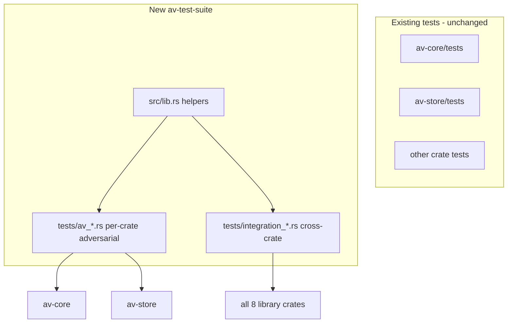
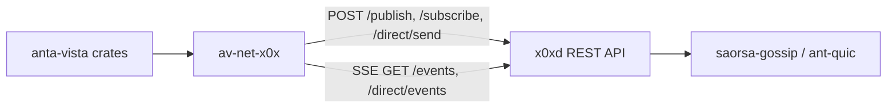

# Independent Adversarial Test Suite

## Goal

Create a **new, separate** test crate that does not replace or migrate the ~125 existing happy-path tests in each crate's `tests/` directories. The new suite is written with an **adversarial mindset**: malformed inputs, boundary conditions, attack simulations, and cross-crate failure modes — targeting gaps the original implementation agent likely did not cover.



## x0x integration context (review finding)

anta-vista networking is **not** via the `x0x` Rust library crate. [`crates/av-net-x0x`](crates/av-net-x0x) is an HTTP/SSE client for a locally running **`x0xd` daemon**:



**Outbound:** `X0xNetClient` via `ureq` — bearer auth from `<data_dir>/api-token`, base URL from `<data_dir>/api.port`.

**Inbound:** `start_listener` / `start_direct_listener` parse SSE `data:` lines with base64-wrapped `MessageEnvelope` JSON.

**Test doubles today:** `MockNetClient` + `MessageDispatcher::validate_incoming` — no HTTP, no SSE, no live daemon.

### Known gaps adversarial tests should probe

These are documented in the threat model but **not fully enforced** in `av-net-x0x` today:

| Threat (docs/threat-model.md) | Claimed mitigation | Actual in code |
|-------------------------------|-------------------|----------------|
| T2 payload flooding | `MAX_PAYLOAD_BYTES` (1 MiB) | Checked in `validate_envelope`, but `raw_size` in listeners is the **SSE JSON line length**, not decoded payload bytes — size bypass possible |
| T3 replay | `sent_at` ±2 min window | **`sent_at` never validated** — only `message_id` dedupe (300s TTL) |
| T4 claim/name poisoning | Signature verification | **`MessageEnvelope` has no signature field**; `NameRecord.signature` can be empty (see `p2p_two_nodes` example) |
| Identity binding | — | SSE `origin` / direct `sender` captured but **never compared** to `envelope.from_agent_id` |
| Rate limiting | `DEFAULT_RATE_LIMIT_PER_MINUTE` | Constant defined in av-core, **unused**; `PayloadGuard` in av-query not wired to listener loop |
| Receive path | Full pipeline | Listeners exist but **not called from any app code or existing tests** |

The adversarial suite should **test these gaps explicitly** — failures are valuable signal, not test bugs.

---

## Architecture

### New workspace member: [`crates/av-test-suite`](crates/av-test-suite)

| Piece | Purpose |
|-------|---------|
| `Cargo.toml` | Depends on all 8 library crates + `proptest`, `tempfile`, `serde_json` |
| `src/lib.rs` | Shared adversarial fixtures, proptest strategies, attack builders |
| `tests/av_*.rs` | One integration-test binary per crate (8 files) |
| `tests/integration_*.rs` | Cross-crate scenario binaries (5 files) |
| `tests/x0x_live_*.rs` | Optional `#[ignore]` tests against real `x0xd` (manual / CI-with-daemon job) |

**Why a lib + tests layout:** Integration test binaries can import `av_test_suite::generators::*` and `av_test_suite::attacks::*` without duplicating setup code. This mirrors how [`examples/Cargo.toml`](examples/Cargo.toml) pulls all crates, but optimized for testing.

Register in root [`Cargo.toml`](Cargo.toml):

```toml
members = [
    # ...existing...
    "crates/av-test-suite",
]
```

Add workspace deps:

```toml
proptest = "1"
```

### Crate metadata

```toml
[package]
name = "av-test-suite"
publish = false
description = "Independent adversarial and cross-crate integration tests"

[lib]
# enables `use av_test_suite::...` from tests/*.rs

[dependencies]
av-core = { workspace = true }
av-store = { workspace = true }
# ... all 8 crates ...
proptest = { workspace = true }
tempfile = { workspace = true }
serde_json = { workspace = true }
```

---

## Shared library modules (`src/lib.rs`)

Extract reusable adversarial primitives (not production code):

**`fixtures`** — temp DB helpers, minimal valid resources, sample magic bytes (reuse patterns from [`crates/av-index/tests/local_search.rs`](crates/av-index/tests/local_search.rs) but centralized)

**`generators`** — `proptest` strategies for:
- Pathological strings (unicode homoglyphs, null bytes, extreme length)
- Malformed TOML/config fragments
- Oversized/near-limit payloads
- Adversarial agent IDs and resource locations

**`attacks`** — reusable scenario builders:
- `SybilCluster` — N low-trust agents flooding corroborating claims
- `ReplayEnvelope` — duplicate `message_id` / stale `sent_at`
- `PoisonedNameRecord` — conflicting name claims from untrusted agents (empty `signature: vec![]` like the p2p example)
- `ResourcePoisoner` — misleading descriptions designed to game cosine similarity with mock embeddings

**`x0x_harness`** — daemon integration helpers (per x0x skill):
- `discover_daemon()` — read `api.port` + `api-token` from default or named data dir (`~/.local/share/x0x/` on Linux)
- `inject_gossip_payload()` — raw `curl` POST to `/publish` with adversarial base64 payloads (bypasses `MockNetClient`)
- `spawn_named_instance(name)` — helper docs for `x0x start --name <name>` two-node topology (separate `api.port` / identity per instance)
- `skip_if_no_daemon()` — `#[ignore]` test guard when `x0xd` not running

---

## Three-tier x0x test strategy

| Tier | Runs in CI default? | What it tests |
|------|---------------------|---------------|
| **Tier 1 — Mock** | Yes | `MockNetClient`, `validate_envelope`, `DedupeCache`, dispatcher, malformed JSON — fast, Windows-safe |
| **Tier 2 — HTTP parsing** | Yes | Unit-test `parse_event` / `parse_direct_event` with crafted SSE lines (no daemon): bad base64, truncated JSON, empty payload, oversized wrapper vs decoded size |
| **Tier 3 — Live x0xd** | No (`#[ignore]`) | Real `X0xNetClient`, `start_listener`, two named instances, cross-agent publish/receive — run locally with `cargo test -p av-test-suite -- --include-ignored` after `x0x start` |

Tier 3 aligns with x0x skill workflow: install `x0xd`, `x0x health`, named instances for two-node tests, bearer auth from `api-token`.

---

## Per-crate adversarial tests (`tests/av_*.rs`)

Each file targets **failure modes and invariants**, not happy paths already covered elsewhere.

### `tests/av_core.rs`
- Invalid/partial TOML configs (unknown keys, wrong types, negative timeouts)
- `normalize_name` / `normalize_scheme` with homoglyphs, empty strings, surrogate pairs
- Proptest: serde roundtrip must not panic on arbitrary UTF-8 strings in `Claim`/`NameRecord` text fields
- Path helpers with `..`, absolute paths, non-UTF8 (platform-gated)

### `tests/av_store.rs`
- Insert strings with SQL metacharacters (`'; DROP TABLE`) — must not corrupt DB (parameterized queries invariant)
- Oversized `description_text` / blob fields at boundary
- Re-open on-disk DB after simulated partial write (corruption handling)
- Concurrent insert/read from multiple threads (if supported; otherwise document `#[ignore]` with reason)

### `tests/av_ingest.rs`
- Truncated magic bytes, polyglot files, empty input
- Filenames with path separators, nulls, 4KB+ names
- Location URIs with disallowed schemes (when config restricts schemes)

### `tests/av_embed.rs`
- Empty description, whitespace-only, 100k+ char text
- Mock provider determinism under adversarial input (must not panic; vectors must remain normalized)
- Mismatched `EmbeddingProfile` IDs stored vs queried (known limitation from [`docs/known-limitations.md`](docs/known-limitations.md))

### `tests/av_index.rs`
- `SchemeFilter` / `MimeFilter` bypass attempts (results must respect filters)
- Search with empty query, single char, repeated tokens
- Name resolution under conflicting records (adversarial trust ordering)

### `tests/av_trust.rs`
- Sybil: 50 agents each adding +1 feedback — ranking must not let single-resource dominate without agreement
- Trust decay edge cases (timestamp in future, epoch zero)
- Agreement score manipulation with correlated low-trust agents

### `tests/av_query.rs`
- Rate limiter: burst at capacity+1, agent ID rotation evasion attempt
- `PayloadGuard` at `MAX_PAYLOAD_BYTES` boundary (+1 byte must reject)
- `AbuseTracker` strike accumulation and block threshold
- Cluster gaming: one agent returns artificially high scores for unique resources

### `tests/av_net_x0x.rs` (Tier 1 + Tier 2)

**Envelope / dispatcher (mock):**
- Oversized envelope rejection at `MAX_PAYLOAD_BYTES` boundary
- Malformed JSON payloads — must return `Err`, never panic
- Dedupe: same `message_id` within 300s TTL; re-accept after TTL expires
- Schema version downgrade (`schema_version != 1`)
- Subscribed-but-unpublished topics: `TOPIC_CLAIM`, `TOPIC_FEEDBACK`, `TOPIC_PRESENCE` — verify subscribe_all registers them even without publish helpers

**SSE parsing adversarial (no daemon — call `parse_event` / `parse_direct_event` directly or via test-only exports):**
- Valid base64 wrapping invalid inner JSON
- Truncated / empty `data:` lines
- `origin` / `sender` differs from `envelope.from_agent_id` — document whether validation should reject (currently passes through)
- **Size bypass:** SSE wrapper under 1 MiB but decoded envelope exceeds limit (exposes `raw_size` semantics bug)
- Direct event wrong `type` field, missing `payload` key

**Identity / trust (mock, documents current behavior):**
- Empty `signature` on `NameClaimPayload` — must not panic; assert current acceptance (gap vs T4)
- `sent_at` in far past/future — assert whether rejected (expected per threat model; likely **fails today** — keep test)

### `tests/x0x_live_daemon.rs` (Tier 3, all `#[ignore]`)

Requires running `x0xd` (and for two-node: `x0x start --name node-a` + `x0x start --name node-b`):

- `X0xConfig::from_data_dir()` discovers agent ID via `GET /agent`
- `subscribe_all` + `publish_query` round-trip through real gossip SSE
- `connect_agent` + `send_direct` between two named instances
- Unauthorized token → `NetError::Http` (not panic)
- Daemon disconnect mid-SSE → listener thread exits cleanly

Document in README:
```bash
x0x start                                    # single-node tier-3 tests
x0x start --name node-a && x0x start --name node-b   # two-node tests
cargo test -p av-test-suite -- --include-ignored
```

---

## Cross-crate integration tests (`tests/integration_*.rs`)

Scenarios that exercise **multiple crates in realistic attack flows**:

### `tests/integration_pipeline_poisoning.rs`
Flow: `av-ingest` → `av-embed` (mock) → `av-store` → `av-index` → `av-trust`

- Resource poisoner publishes misleading description; verify it does not outrank honest resources after trust weighting
- Conflicting `NameRecord`s from sybil agents; verify low-trust sources are discounted per ranking formula

### `tests/integration_query_abuse.rs`
Flow: `av-net-x0x` (mock) → `av-query` (cluster/guard/abuse) → `av-store`

- Flood mock responses from many agent IDs; rate limiter and abuse tracker must block/throttle
- Oversized `ResponsePayload` rejected before storage side effects
- Agent ID rotation evasion against `RateLimiter` token bucket

### `tests/integration_x0x_receive_path.rs`
Flow: `av-net-x0x` listener → `validate_incoming` → (future) payload dispatch

This is the **missing wire-to-app path** not covered by existing tests or `p2p_two_nodes` example (which is publish-only):

- Wire a minimal receive loop: inject event via `MockNetClient` or parsed SSE fixture → `MessageDispatcher::validate_incoming` → assert accept/reject
- Spoofed `from_agent_id` in envelope vs transport `origin` — adversarial test documents expected rejection
- Replay after dedupe TTL expiry — message re-processed (intended or gap?)
- Verify `PayloadGuard` / `AbuseTracker` can be applied at receive boundary (integration design test even if wiring is added later)

### `tests/integration_persistence_tamper.rs`
Flow: `av-store` (on-disk) → `av-index` → reopen

- Populate DB, tamper with SQLite file bytes, reopen — must fail gracefully (no panic)
- WAL mode survives abrupt close (partial coverage of on-disk invariants)

### `tests/integration_config_mismatch.rs`
Flow: `av-core` config → pipeline components

- Restricted `allowed_schemes` in config must propagate to ingest/index filtering behavior
- Invalid config must prevent silent defaults on dangerous values

---

## Coverage matrix (all crates exercised)

| Crate | Per-crate adversarial file | Cross-crate integration |
|-------|---------------------------|-------------------------|
| av-core | `av_core.rs` | `integration_config_mismatch.rs` |
| av-store | `av_store.rs` | `integration_persistence_tamper.rs` |
| av-ingest | `av_ingest.rs` | `integration_pipeline_poisoning.rs` |
| av-embed | `av_embed.rs` | `integration_pipeline_poisoning.rs` |
| av-index | `av_index.rs` | `integration_pipeline_poisoning.rs` |
| av-trust | `av_trust.rs` | `integration_pipeline_poisoning.rs` |
| av-query | `av_query.rs` | `integration_query_abuse.rs` |
| av-net-x0x | `av_net_x0x.rs`, `x0x_live_daemon.rs` | `integration_query_abuse.rs`, `integration_x0x_receive_path.rs` |

---

## CI and documentation

### CI ([`.github/workflows/ci.yml`](.github/workflows/ci.yml))

No structural change required — `cargo test --workspace` will pick up the new member automatically.

Optional clarity addition to the `test` job:

```yaml
- run: cargo test -p av-test-suite -- --test-threads=1  # if any tests need serial DB access
```

Only add `--test-threads=1` if concurrent on-disk tests prove flaky; start with default parallelism.

Windows: `av-test-suite` depends on `av-net-x0x`, so the existing `test-windows` job (`--exclude av-net-x0x`) will **also exclude the new suite** unless changed. Options (pick during implementation):

- **A (recommended):** Split `av-test-suite` into `av-test-suite` (no `av-net-x0x` dep) + `av-test-suite-net` (net + x0x tests) — windows runs the former
- **B:** Gate net/x0x test binaries with `#[cfg(not(target_os = "windows"))]` inside a single crate
- **C:** Fix underlying `av-net-x0x` Windows issues and remove the exclude entirely

Tier 1–2 x0x tests (mock + SSE parsing) should run on Windows; only Tier 3 live-daemon tests stay `#[ignore]`.

Optional CI job for Tier 3 (not in default PR path):

```yaml
x0x-live:
  runs-on: ubuntu-latest
  steps:
    - uses: actions/checkout@v4
    - uses: dtolnay/rust-toolchain@stable
    # Install x0xd per x0x skill (pre-built binary)
    - run: curl -sfL "https://github.com/saorsa-labs/x0x/releases/latest/download/x0x-linux-x64-gnu.tar.gz" | tar xz
    - run: cp x0x-linux-x64-gnu/x0xd ~/.local/bin/ && x0x start
    - run: cargo test -p av-test-suite -- --include-ignored
```

### README ([`README.md`](README.md))

Add a section under "Running tests":

```bash
cargo test -p av-test-suite              # adversarial suite (Tier 1–2, no daemon)
cargo test --workspace                   # existing + adversarial
x0x start && cargo test -p av-test-suite -- --include-ignored   # Tier 3 live x0x
```

### `.gitignore`

No changes needed (test crate produces no cache artifacts).

---

## Implementation order

1. Scaffold `crates/av-test-suite` (Cargo.toml, empty lib, workspace registration)
2. Build `src/lib.rs` fixtures + generators + attack builders
3. Implement per-crate adversarial files (start with `av_net_x0x` + `x0x_harness` — highest x0x/threat-model gap density)
4. Implement cross-crate integration files (include `integration_x0x_receive_path`)
5. Add Tier 3 `x0x_live_daemon.rs` with `#[ignore]` stubs and README instructions
6. Run full workspace test suite; fix any **real bugs uncovered** (tests that expose defects should be kept, not weakened)
7. Update README and verify CI passes on ubuntu/macos/windows; decide Windows split (option A/B/C)

---

## Expectations

- Some adversarial tests **may fail initially** — that is the point. Failures indicate real gaps; fix the implementation, not the test, unless the test expectation is wrong per spec.
- Tier 3 live `x0xd` tests are `#[ignore]` by default (no CI flake risk); optional `x0x-live` CI job can run them on demand.
- Real MiniLM tests stay in existing `av-embed` crate; new suite uses mock embeddings only.
- Several x0x adversarial tests are **expected to fail initially** (e.g. `sent_at` replay, identity binding, `raw_size` bypass) — these document gaps between [`docs/threat-model.md`](docs/threat-model.md) and current `av-net-x0x` implementation.
- Existing per-crate tests remain **completely untouched** — two complementary layers: happy-path (original) + adversarial (new).
