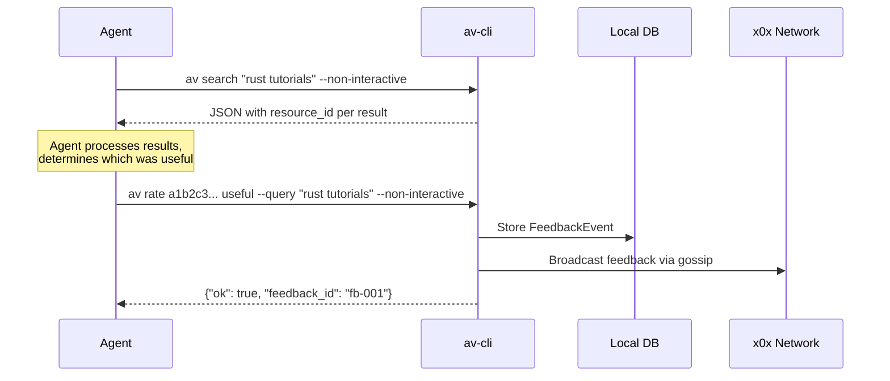

# av-cli — Implementation Plan

A Rust CLI binary for interacting with the anta-vista distributed search and naming system. Targets human-interactive and machine/agent workflows.

## Background

The [av-cli spec](file:///home/madcowe/Downloads/av-cli_spec.md) describes a cross-platform CLI that wraps the existing anta-vista library crates ([workspace Cargo.toml](file:///home/lab/Development/rust/projects/anta-vista/Cargo.toml)). The CLI must:

1. Provide **resolve** (DNS-like naming) and **search** (semantic) commands
2. Provide **name** (register a name → URI) and **index** (ingest + embed a URI) commands
3. Support both **interactive** (human, with rating prompts) and **non-interactive** (agent/script, JSON output) modes
4. On first run, **check and offer to install** x0x daemon, ant daemon, and MiniLM model
5. Handle downloading content from both `ant://` (via `antd` REST API) and `http(s)://` (via `ureq`)
6. Provide a **purge** command to clear local database entries and stop broadcasting stale data

---

## Confirmed Decisions

All open questions have been resolved:

| Decision | Resolution |
|----------|------------|
| **Trust principle** | ✅ `av-cli` reads trust but never writes to `x0x /contacts/trust`. Internal `av-trust` scoring only. |
| **`antd` daemon** | ✅ Required for `ant://` indexing. CLI detects at startup, offers install guidance. No subprocess fallback. |
| **MiniLM model** | ✅ `fastembed` auto-downloads on first use. Startup check verifies; no separate install step. |
| **Rating granularity** | ✅ Option C — best-pick by default, `--rate-each` flag for per-result rating. |
| **Response timeout** | ✅ Option C — wait `--timeout` by default, `--stream` for progressive output. |
| **Duplicate handling** | ✅ `index`: skip re-ingest if SHA-256 matches (unless `--force`), allow tag updates. `name`: update timestamp if same agent+name+target, else new record. |

---

## Proposed Changes

### New Crate: `av-cli`

#### [NEW] [Cargo.toml](file:///home/lab/Development/rust/projects/anta-vista/crates/av-cli/Cargo.toml)

New binary crate added to the workspace.

**Key dependencies:**
- `clap` (v4, derive) — CLI argument parsing with subcommands
- `av-core`, `av-store`, `av-embed`, `av-ingest`, `av-index`, `av-trust`, `av-query`, `av-net-x0x` — all existing workspace crates
- `ureq` — HTTP client (for downloading `http(s)://` content and talking to `antd`)
- `serde_json` — JSON output for non-interactive mode
- `dialoguer` — interactive prompts (rating, confirmation)
- `indicatif` — progress bars (model download, content fetch)
- `console` — terminal colours and formatting
- `tracing`, `tracing-subscriber` — structured logging

```toml
[package]
name = "av-cli"
version = "0.1.0"
edition = "2021"

[[bin]]
name = "av"
path = "src/main.rs"

[dependencies]
clap = { version = "4", features = ["derive"] }
av-core = { path = "../av-core" }
av-store = { path = "../av-store" }
av-embed = { path = "../av-embed" }
av-ingest = { path = "../av-ingest" }
av-index = { path = "../av-index" }
av-trust = { path = "../av-trust" }
av-query = { path = "../av-query" }
av-net-x0x = { path = "../av-net-x0x" }
ureq = "2"
serde = { version = "1", features = ["derive"] }
serde_json = "1"
dialoguer = "0.11"
indicatif = "0.17"
console = "0.15"
tracing = "0.1"
tracing-subscriber = { version = "0.3", features = ["env-filter"] }
directories = "6"
base64 = "0.22"
rusqlite = { version = "0.31", features = ["bundled"] }
tempfile = "3"
```

---

#### [NEW] [main.rs](file:///home/lab/Development/rust/projects/anta-vista/crates/av-cli/src/main.rs)

Entry point. Parses CLI args via clap, runs startup checks, dispatches to command modules.

```
av [OPTIONS] <COMMAND>

Options:
  --non-interactive    Machine mode: JSON output, no prompts
  --config <PATH>      Path to config.toml (default: auto-detect)
  --timeout <MS>       Network response timeout in ms (default: 5000)
  --stream             Show results progressively as they arrive
  -v, --verbose        Increase log verbosity (repeatable)
  -h, --help
  -V, --version

Commands:
  resolve   Resolve a name to URI(s) via DNS-like lookup
  search    Semantic search for resources
  name      Register a name → URI mapping
  index     Ingest and index a URI for search
  rate      Submit feedback rating for a resource
  purge     Clear local database entries and broadcast cache
  status    Show daemon and model health status
```

---

#### [NEW] [startup.rs](file:///home/lab/Development/rust/projects/anta-vista/crates/av-cli/src/startup.rs)

Runs on every invocation. Checks for required infrastructure:

1. **x0x daemon** — Reads `api.port` + `api-token` from the x0x data dir (per the [x0x skill](file:///home/lab/.gemini/antigravity/knowledge/x0x-networking-skill/artifacts/skill.md)); calls `GET /health`. If not running:
   - Interactive: Offer to run `x0x start` (if binary found in PATH) or print install instructions
   - Non-interactive: Exit with structured JSON error `{"error": "x0x_daemon_not_running", ...}`

2. **ant daemon** (`antd`) — Calls `GET http://localhost:8082/health` (per the [autonomi skill](file:///home/lab/.gemini/antigravity/knowledge/autonomi-developer-skill/artifacts/skill.md)). If not running:
   - Only required for `index` on `ant://` URIs. For other commands, warn but don't block.
   - Interactive: Offer guidance to install/start `antd`
   - Non-interactive: Return warning in JSON metadata

3. **MiniLM model** — Attempts `MiniLmProvider::new()`. If it fails (e.g. no internet for first download):
   - Required for `search` and `index`. Not needed for `resolve`, `name`, `rate`, `purge`.
   - Interactive: Show progress bar during download via `indicatif`
   - Non-interactive: Exit with structured error if required and unavailable

The check results are cached for the process lifetime — no re-checking on every subcommand.

---

#### [NEW] [cmd/resolve.rs](file:///home/lab/Development/rust/projects/anta-vista/crates/av-cli/src/cmd/resolve.rs)

```
av resolve <NAME> [OPTIONS]
  --type <TYPE>       Record type filter: A, Txt, Uri, Service (default: all)
  --scheme <SCHEME>   Filter results by target scheme (e.g. ant, https)
  --limit <N>         Max results (default: 10)
```

**Flow:**
1. Query local SQLite via [lookup_name()](file:///home/lab/Development/rust/projects/anta-vista/crates/av-index/src/naming.rs#L20-L119) — instant results
2. If `--stream` or waiting for network: broadcast a name query via [MessageDispatcher::publish_name_query()](file:///home/lab/Development/rust/projects/anta-vista/crates/av-net-x0x/src/dispatcher.rs#L97-L121)
3. Listen on x0x SSE `/events` for `NameResponse` messages (reuse [start_listener()](file:///home/lab/Development/rust/projects/anta-vista/crates/av-net-x0x/src/listener.rs#L24-L88))
4. Merge and deduplicate results by `record_id`
5. Sort by [name_score()](file:///home/lab/Development/rust/projects/anta-vista/crates/av-core/src/constants.rs#L38-L41) (trust + agreement + recency + TTL validity)

**Interactive output:**
```
Resolving "my-app"...

  # │ Target                        │ Type │ Score │ TTL   │ By Agent
  1 │ ant://deadbeef1234...         │ Uri  │ 0.92  │ valid │ a3f8...
  2 │ https://my-app.example.com    │ Uri  │ 0.78  │ valid │ b7c2...

Rate the best result? [1/2/skip]:
```

**Non-interactive output (JSON):**
```json
{
  "query": "my-app",
  "results": [
    {
      "record_id": "nr-001",
      "target": "ant://deadbeef1234...",
      "record_type": "Uri",
      "score": 0.92,
      "trust_score": 0.85,
      "agreement_score": 0.70,
      "by_agent_id": "a3f8...",
      "ttl_valid": true
    }
  ],
  "source": "local+network",
  "elapsed_ms": 1234
}
```

---

#### [NEW] [cmd/search.rs](file:///home/lab/Development/rust/projects/anta-vista/crates/av-cli/src/cmd/search.rs)

```
av search <QUERY> [OPTIONS]
  --scheme <SCHEME>   Filter by URI scheme
  --kind <KIND>       Filter by resource kind: text, image, audio, file, pdf
  --mime <MIME>       Filter by MIME type
  --limit <N>         Max results (default: 10)
```

**Flow:**
1. Embed query text via `EmbeddingProvider::embed_text()`
2. Local search via [search_top_k()](file:///home/lab/Development/rust/projects/anta-vista/crates/av-index/src/search.rs#L22-L87)
3. Broadcast query via [MessageDispatcher::publish_query()](file:///home/lab/Development/rust/projects/anta-vista/crates/av-net-x0x/src/dispatcher.rs#L57-L80)
4. Collect network responses; merge with local results
5. Apply [cold-start clustering](file:///home/lab/Development/rust/projects/anta-vista/crates/av-query/src/cluster.rs) if trust data is sparse

**Interactive output:**
```
Searching: "rust tutorials for beginners"

  # │ Resource                      │ Score │ Kind │ Location
  1 │ a rust programming tutorial   │ 0.94  │ Text │ https://example.com/rust.html
  2 │ rust getting started guide    │ 0.87  │ Pdf  │ ant://abc123...
  3 │ learn rust audio course       │ 0.72  │ Audio│ https://example.com/rust.mp3

Rate the best result? [1/2/3/skip]:
```

**Non-interactive output (JSON):**
```json
{
  "query": "rust tutorials for beginners",
  "results": [
    {
      "resource_id": "a1b2c3d4e5f6...",
      "description": "a rust programming tutorial",
      "score": 0.94,
      "semantic_score": 0.96,
      "agreement_score": 0.5,
      "feedback_score": 0.5,
      "trust_score": 0.5,
      "kind": "Text",
      "location": "https://example.com/rust.html",
      "mime_type": "text/html"
    }
  ],
  "source": "local+network",
  "elapsed_ms": 2345
}
```

> [!NOTE]
> The `resource_id` field is the SHA-256 content hash. Agents/apps use this to submit ratings via `av rate`.

---

#### [NEW] [cmd/name.rs](file:///home/lab/Development/rust/projects/anta-vista/crates/av-cli/src/cmd/name.rs)

```
av name <URI> <NAME> [OPTIONS]
  --type <TYPE>       Record type: A, Txt, Uri, Service (default: Uri)
  --ttl <SECS>        TTL in seconds (default: 3600)
  --no-verify         Skip URI reachability check
```

**Flow:**
1. Parse and validate the URI using [analyze_location()](file:///home/lab/Development/rust/projects/anta-vista/crates/av-ingest/src/location.rs#L8-L39)
2. Unless `--no-verify`: Check if the resource exists
   - `http(s)://` → `ureq::head()` to check reachability
   - `ant://` → `GET http://localhost:8082/v1/data/public/{addr}` via `antd` (per autonomi skill — read-only, no wallet needed)
3. Check for existing name records for this name+target+agent in local DB. If exists, update timestamp.
4. Build a [NameRecord](file:///home/lab/Development/rust/projects/anta-vista/crates/av-core/src/types.rs#L128-L141) and store locally via `av_store::repo::names`
5. Broadcast via [MessageDispatcher::publish_name_claim()](file:///home/lab/Development/rust/projects/anta-vista/crates/av-net-x0x/src/dispatcher.rs#L144-L152)

**Interactive output:**
```
Registering name "my-app" → ant://deadbeef1234...
  ✓ URI verified (ant daemon)
  ✓ Name record stored locally
  ✓ Claim broadcast to network
```

**Non-interactive output (JSON):**
```json
{
  "ok": true,
  "record_id": "nr-001",
  "name": "my-app",
  "normalized_name": "my-app",
  "target": "ant://deadbeef1234...",
  "record_type": "Uri",
  "ttl_secs": 3600,
  "verified": true,
  "updated_existing": false,
  "broadcast": true
}
```

---

#### [NEW] [cmd/index.rs](file:///home/lab/Development/rust/projects/anta-vista/crates/av-cli/src/cmd/index.rs)

```
av index <URI> [OPTIONS]
  --tags <TAGS>       Comma-separated tags to add to description
  --no-download       Skip downloading content (use URI metadata only)
  --no-verify         Skip URI reachability check
  --force             Re-index even if resource already exists
```

**Flow:**
1. **Download content** based on URI scheme:
   - `http(s)://` → Download via `ureq::get()`. Cross-platform, no external tools needed.
   - `ant://` → Download via `antd` REST API:
     - Extract 64-hex address from URI (already handled by [analyze_location](file:///home/lab/Development/rust/projects/anta-vista/crates/av-ingest/src/location.rs))
     - `GET http://localhost:8082/v1/data/public/{addr}` → returns base64-encoded data
     - Decode and use as content bytes
   - `file://` → Read from local filesystem via [ingest_file()](file:///home/lab/Development/rust/projects/anta-vista/crates/av-ingest/src/ingest.rs#L65-L70)
2. **Check for duplicates**: SHA-256 hash of content. If exists and not `--force`, skip with notice.
3. **Ingest** via [ingest_bytes()](file:///home/lab/Development/rust/projects/anta-vista/crates/av-ingest/src/ingest.rs#L15-L62) — MIME detection, metadata, description synthesis
4. **Interactive tag entry**: If not `--non-interactive` and no `--tags`, prompt for tags
5. **Append tags** to the description text (e.g. `"{description} tagged as: rust, tutorial, beginner"`)
6. **Embed** via `EmbeddingProvider::embed_resource()` using the description text
7. **Store** resource + embedding in SQLite via `av_store::repo::resources` and `av_store::repo::embeddings`
8. **Broadcast** a claim about the resource via the gossip network

**Interactive output:**
```
Indexing: https://example.com/rust-tutorial.pdf
  ✓ Downloaded (245 KB)
  ✓ Detected: application/pdf
  ✓ Description: "a rust tutorial document report in pdf format"
  Enter tags (comma-separated, or press Enter to skip): rust, tutorial, beginner
  ✓ Embedded (384 dimensions)
  ✓ Stored locally
  ✓ Broadcast to network
```

**Non-interactive output (JSON):**
```json
{
  "ok": true,
  "resource_id": "a1b2c3d4e5f6...",
  "location": "https://example.com/rust-tutorial.pdf",
  "mime_type": "application/pdf",
  "kind": "Pdf",
  "description": "a rust tutorial document report in pdf format tagged as: rust, tutorial, beginner",
  "embedding_dim": 384,
  "duplicate": false,
  "broadcast": true
}
```

> [!NOTE]
> When `duplicate` is `true` (resource already indexed, no `--force`), the response includes `"skipped": true` and the existing `resource_id`. Tags can still be updated on duplicates.

---

#### [NEW] [cmd/rate.rs](file:///home/lab/Development/rust/projects/anta-vista/crates/av-cli/src/cmd/rate.rs)

```
av rate <RESOURCE_ID> <RATING> [OPTIONS]
  <RATING>            useful | not-useful | incorrect | high-confidence
  --query <TEXT>       Original query context (improves feedback quality)
```

Maps to [FeedbackEvent](file:///home/lab/Development/rust/projects/anta-vista/crates/av-core/src/types.rs#L91-L101) and stores via `av_store::repo::feedback`. Broadcasts feedback to the gossip network.

**This is the dedicated command for agents/apps to submit ratings programmatically.** The workflow:



**Agent/app example (two-step flow):**
```bash
# Step 1: Search and capture results
RESULTS=$(av search "rust tutorials" --non-interactive)

# Step 2: Extract resource_id and submit rating
RID=$(echo "$RESULTS" | jq -r '.results[0].resource_id')
av rate "$RID" useful --query "rust tutorials" --non-interactive
```

**Non-interactive output (JSON):**
```json
{
  "ok": true,
  "feedback_id": "fb-001",
  "resource_id": "a1b2c3d4e5f6...",
  "rating": "useful",
  "broadcast": true
}
```

**Batch rating** — agents can call `av rate` multiple times to rate several results from the same search:
```bash
av rate "$RID1" useful     --query "rust tutorials" --non-interactive
av rate "$RID2" not-useful  --query "rust tutorials" --non-interactive
av rate "$RID3" incorrect   --query "rust tutorials" --non-interactive
```

> [!NOTE]
> Interactive mode also generates ratings implicitly: when a human picks "result #1 was best" after a search, `av-cli` automatically creates a `Useful` FeedbackEvent for the selected result and `NotUseful` for the others (with `--rate-each` allowing individual control). The `av rate` command exists so agents can do the same thing without the interactive prompt.

---

#### [NEW] [cmd/purge.rs](file:///home/lab/Development/rust/projects/anta-vista/crates/av-cli/src/cmd/purge.rs)

```
av purge [OPTIONS]
  --resource <ID>     Delete a specific resource and its embeddings
  --name <NAME>       Delete name records for a specific name
  --all               Clear entire local database (with confirmation)
  --cache             Clear only the query cache
  --no-confirm        Skip confirmation prompt (for scripting)
```

**Flow:**
1. Delete specified records from SQLite
2. For `--all`: Drop and recreate tables using the [schema migrations](file:///home/lab/Development/rust/projects/anta-vista/crates/av-store/src/schema.rs)
3. Note: Cannot "un-broadcast" data already sent via gossip — the purge only affects local state. The CLI will print a warning about this.

**Non-interactive output (JSON):**
```json
{
  "ok": true,
  "deleted": {
    "resources": 42,
    "embeddings": 42,
    "name_records": 5,
    "feedback_events": 12,
    "query_cache": 100
  },
  "warning": "Previously broadcast data cannot be recalled from the gossip network"
}
```

---

#### [NEW] [cmd/status.rs](file:///home/lab/Development/rust/projects/anta-vista/crates/av-cli/src/cmd/status.rs)

```
av status
```

Prints the health status of all dependencies (not in the original spec, but very useful for debugging):

**Interactive output:**
```
anta-vista status
  x0x daemon:  ✓ running (agent: a3f8..., API: 127.0.0.1:12700)
  ant daemon:  ✓ running (network: default, version: 0.7.1)
  MiniLM model: ✓ loaded (384 dimensions)
  Database:    ✓ 1,234 resources, 456 name records
  Config:      ~/.config/saorsa-labs/anta-vista/config.toml
```

**Non-interactive output (JSON):**
```json
{
  "x0x_daemon": {"running": true, "agent_id": "a3f8...", "api": "127.0.0.1:12700"},
  "ant_daemon": {"running": true, "network": "default", "version": "0.7.1"},
  "minilm_model": {"loaded": true, "dimensions": 384},
  "database": {"resources": 1234, "name_records": 456, "embeddings": 1234, "feedback_events": 89},
  "config_path": "~/.config/saorsa-labs/anta-vista/config.toml"
}
```

---

#### [NEW] [output.rs](file:///home/lab/Development/rust/projects/anta-vista/crates/av-cli/src/output.rs)

Shared output formatting module. Handles the dual-mode requirement:

- **Interactive**: Coloured tables via `console`, progress bars via `indicatif`, rating prompts via `dialoguer`
- **Non-interactive**: Clean JSON to stdout, errors to stderr. Parseable by agents and scripts.

---

#### [NEW] [download.rs](file:///home/lab/Development/rust/projects/anta-vista/crates/av-cli/src/download.rs)

Content download abstraction. Three backends:

| Scheme | Method | Cross-platform? |
|--------|--------|:---:|
| `http(s)://` | `ureq::get()` — pure Rust, no `curl` dependency | ✓ |
| `ant://` / `autonomi://` | `antd` REST API (`GET /v1/data/public/{addr}`) | ✓ (needs `antd`) |
| `file://` | `std::fs::read()` | ✓ |

> [!NOTE]
> The spec asked *"for http/https how would we do this as would something like curl be available in all os?"*. Using `ureq` (pure Rust HTTP client, already a dependency of `av-net-x0x`) avoids any external tool dependency. This works on Linux, macOS, Windows, and Android/Termux.

---

#### [NEW] [network.rs](file:///home/lab/Development/rust/projects/anta-vista/crates/av-cli/src/network.rs)

Manages the three-tier response strategy:

```
┌─────────────────────────────────────────────────┐
│ Tier 1: Local DB (instant)                      │
│   → search_top_k() / lookup_name()              │
├─────────────────────────────────────────────────┤
│ Tier 2: Direct peers (~seconds)                 │
│   → send_direct_query() to known trusted agents │
├─────────────────────────────────────────────────┤
│ Tier 3: Gossip broadcast (may be slow)          │
│   → publish_query() / publish_name_query()      │
│   → listen on SSE /events for responses         │
└─────────────────────────────────────────────────┘
```

- Default behaviour: show Tier 1 results immediately if any exist, then wait up to `--timeout` for Tier 2+3
- `--stream` flag: progressively print results as they arrive from each tier
- Tier 2 requires known peers in the peer_cache table — initially empty, populated by gossip discovery

---

### Workspace Integration

#### [MODIFY] [Cargo.toml](file:///home/lab/Development/rust/projects/anta-vista/Cargo.toml)

Add `crates/av-cli` to workspace members. Add shared dependencies (`clap`, `dialoguer`, `indicatif`, `console`) to `[workspace.dependencies]`.

```diff
 [workspace]
 members = [
     "crates/av-core",
     "examples",
     "crates/av-store",
     "crates/av-ingest",
     "crates/av-embed",
     "crates/av-index",
     "crates/av-net-x0x",
     "crates/av-trust",
     "crates/av-query",
     "crates/av-test-suite",
     "crates/av-probe",
+    "crates/av-cli",
 ]
```

---

## Additional Suggestions (Not in Original Spec)

1. **`av status` command** — Already included above. Essential for debugging daemon connectivity.

2. **Shell completions** — `clap` supports generating bash/zsh/fish completions via `clap_complete`. Low effort, high value for human users. Could be added as `av completions <SHELL>`.

3. **`av peers` command** — List discovered peers from the `peer_cache` table and show their trust scores. Useful for understanding the network view without having to use `x0x agents list` separately.

4. **Config generation** — `av init` to generate a default `config.toml` in the appropriate directory.

---

## Verification Plan

### Automated Tests

```bash
# Unit tests for all new modules
cargo test -p av-cli

# Workspace-wide to ensure no regressions
cargo test --workspace

# Build the binary for all features
cargo build --release -p av-cli
```

**Integration tests** (in `crates/av-cli/tests/`):
- `startup_no_daemon.rs` — Verify graceful error when no x0x daemon is running
- `index_local_file.rs` — Index a local file (mock embedding provider), verify it appears in search results
- `resolve_local.rs` — Register a name, then resolve it, verify round-trip
- `purge.rs` — Index, purge, verify gone
- `json_output.rs` — Verify non-interactive JSON output is valid and parseable

### Manual Verification
- Start x0x daemon, run `av status`, verify all green
- `av index https://example.com --tags test` → verify download + ingest
- `av search "example"` → verify result appears
- `av name ant://... my-test` → `av resolve my-test` → verify round-trip
- `av rate <id> useful` → verify feedback stored
- `av purge --all` → verify clean slate

### Cross-Platform
- Build and test on Linux x86_64 (primary)
- Cross-compile check for Windows: `cargo check --target x86_64-pc-windows-gnu -p av-cli`
